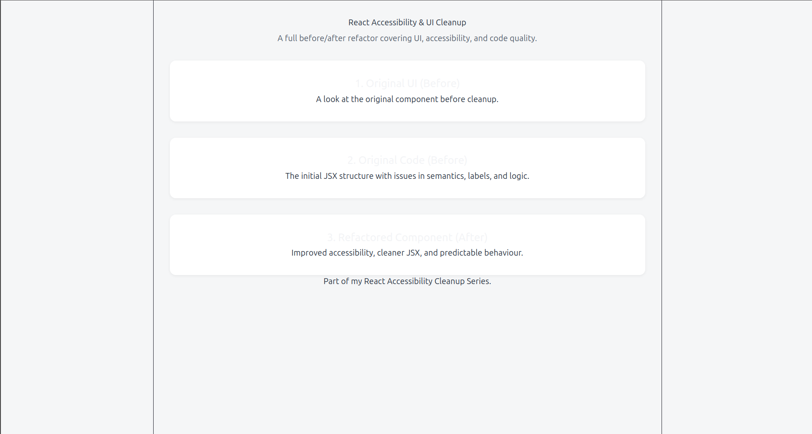
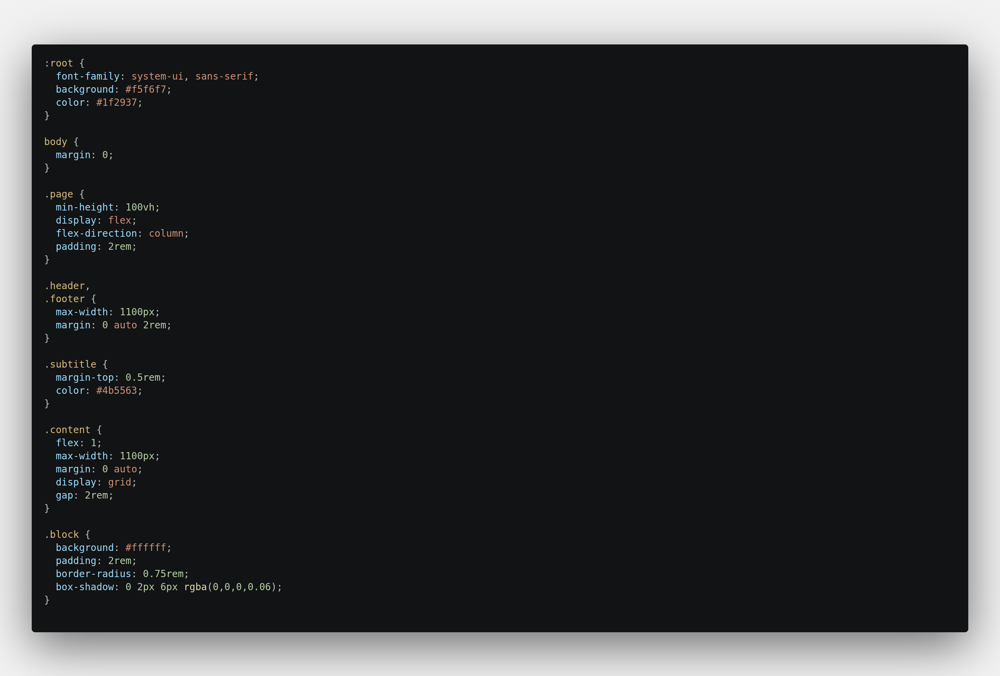
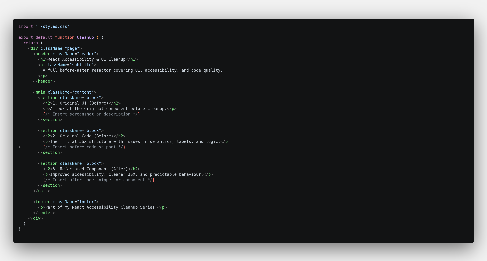
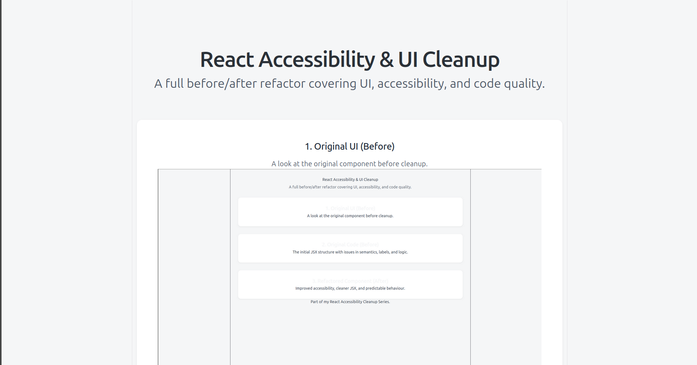
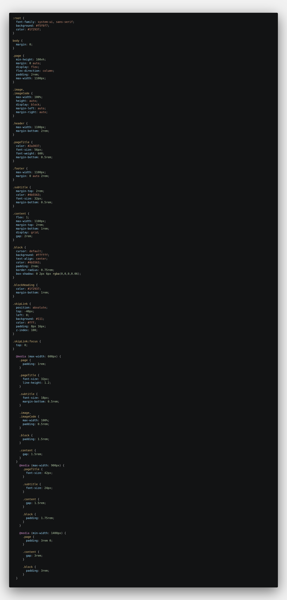
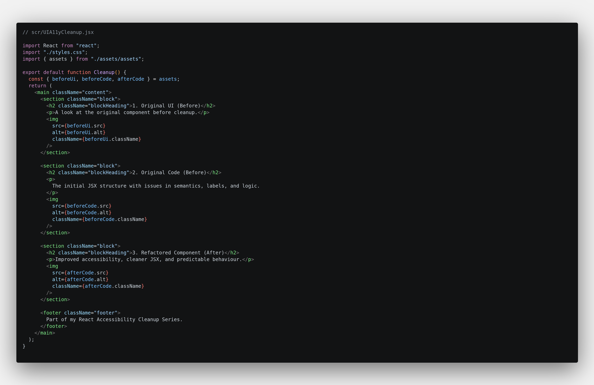

# React UI, A11y and Code Cleanup

This project showcases a full before‑and‑after refactor of a React component, focusing on accessibility, UI consistency, and code quality. It demonstrates how to take an existing component with layout issues, semantic problems, and WCAG warnings, and transform it into a clean, responsive, maintainable, and accessible piece of UI. The example reflects the kind of practical, high‑impact improvements often needed in real‑world frontend work.

---

## 🔧 What This Example Shows

This example demonstrates how to take an existing React component and improve it without changing its core functionality. The focus is on:

- fixing accessibility issues (WCAG‑friendly headings, alt text, semantics)

- cleaning up JSX structure

- improving layout and spacing

- removing unnecessary wrappers and redundant code

- making the UI responsive across screen sizes

- applying consistent, maintainable CSS

- improving readability for both users and developers
 
---

## 📁 Project Structure
```
react-ui-a11y-code-cleanup/
|── before/
│     ├── BeforeUIA11yCleanup.jsx   ← original version (before)
|     └── Before Styles.css  
├── src/
│     ├── UIA11yCleanup.jsx   ← cleaned version (after)
│     ├── styles.css
│     └── App.jsx
└── README.md
```

The **before** and **after** versions are kept separate so you can clearly see the improvements.

---

## ▶️ Running the Project

**Install dependencies:**

Start the dev server:

Install dependencies:
- npm install

Start the dev server:
- npm run dev

Then open the local URL shown in the terminal to view the component in the browser.

## 🛠 Tech Stack

- React  
- Vite  
- JavaScript (ES6+)  
- JSX
- CSS  

---

## 📝 Before → After Summary

### Before (BeforeUIA11yCleanup.jsx)

The original component had several issues:

- headings were undersized, inconsistent, or not WCAG‑compliant
- layout spacing was uneven and not responsive
- images were not centred and had inconsistent padding
- semantic structure was unclear (sections, headings, main content)
- CSS was repetitive and difficult to maintain
- accessibility warnings appeared in DevTools
- the UI collapsed or looked unbalanced on large screens

The component worked, but it wasn’t polished, accessible, or easy to extend.

### After (UIA11yCleanup.jsx)

The refactored version includes:

- proper semantic structure (header, main, section, footer)
- WCAG‑friendly heading sizes, contrast, and hierarchy
- responsive layout using clean media queries
- centred, trimmed images with consistent spacing
- simplified, maintainable CSS
- improved readability and structure in JSX
- optional skip‑to‑content link for keyboard accessibility
- consistent visual rhythm across all screen sizes

The result is a cleaner, more accessible, more professional component that behaves predictably and is easier to maintain. 

---

## 📸 Screenshots

**Before UI**


**Before Styles**


**Before Code**


**After UI**


**After Styles**


**After Code**


---

## 💡 Why This Project Matters

Most real‑world frontend work isn’t building huge apps — it’s fixing the things that make existing components hard to use or maintain:

- spacing

- layout

- accessibility

- messy components

- inconsistent styling

- confusing logic

- and all the small issues that add up over time

This project shows how targeted refactoring can quickly improve usability, accessibility, and code quality without rewriting everything from scratch. It’s a realistic example of the kind of high‑impact, fast‑turnaround improvements I specialise in.

---

## Live Demo

View the project here:
https://katemills74-a11y.github.io/react-ui-a11y-code-cleanup/

## 📬 Want Something Similar?

If you need help cleaning up your React components, improving UI consistency, or fixing layout and accessibility issues, I can help.  
